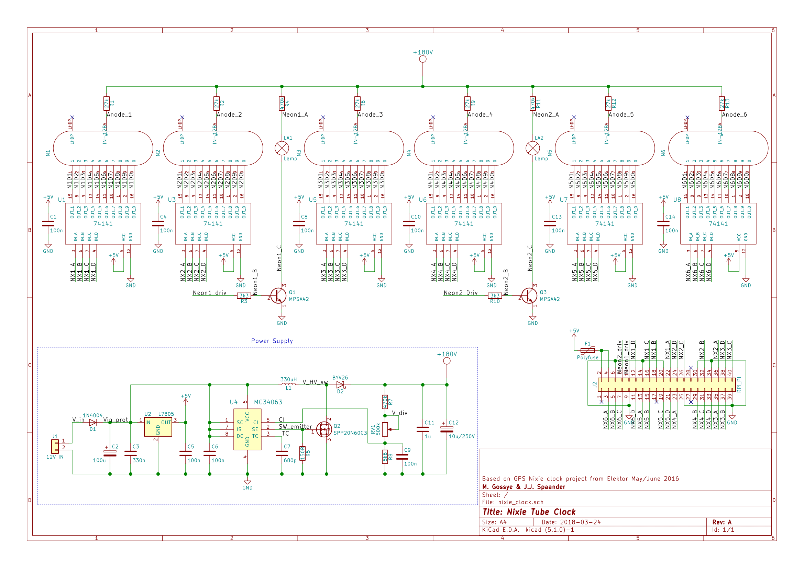

# NixieClockHardware
6 digit RPi powered Nixie Clock Hardware repository

Software/source code can be found in the following repository: https://github.com/midasgossye/NixieClock/

If you are interested in a having this unique Nixie Clock, but don't want to build it from scratch, we sell these at our tindie store!

/i/92521/products/2019-04-29T16%3A27%3A55.943Z-nixie2.jpg)

## Authors

* **Midas Gossye** - [Github](https://github.com/midasgossye)
* **Joshua Spaander** - [Github](https://github.com/joshuaspaander)

## Acknowledgments

* This project was inspired by and partly based on the New Precise Nixie Clock from the May 2016 issue of Elektor Magazine [(link)](https://www.elektormagazine.com/magazine/elektor-201605/28960)
* IoT connectivity inspired by EEVBlog Nixie Tube Display Project [(link)](https://www.youtube.com/playlist?list=PLvOlSehNtuHutdg1kZkG7aAYhjoJnk2fc)
